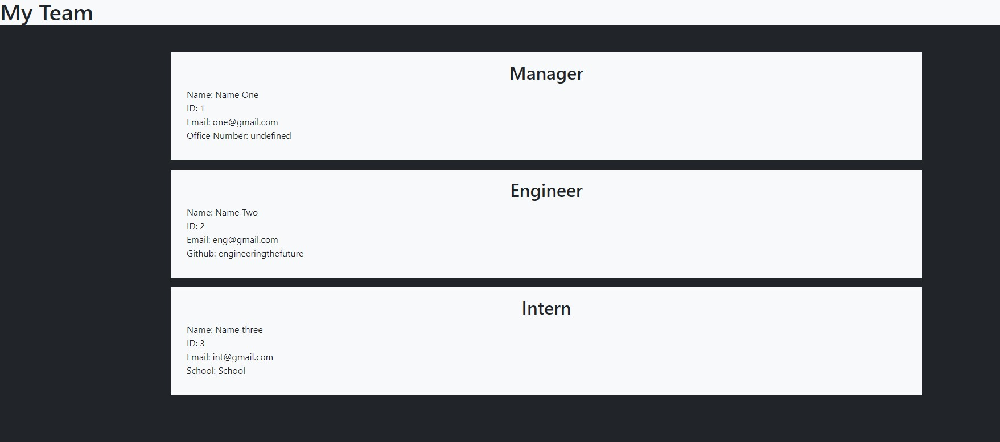

# 10-team-profile-generator

## Description 

This CLI application allows a user to build a team of employees based on three roles: Manager, Engineer, and Intern. Each employee will have a Name, Id, and Email assigned to them. The Manager has an option to include an office number. The Engineer has an option to include their github username. The Intern has an option to include their school name. This application includes the following object oriented programming (OOP) features:
- Classes
    - Parent Class extends to other classes
    - Constructors
    - Methods
- Module.exports between JS files
- Tests using Jest

Once the user has completed the CLI application, a custome .html file will be generated.

## Table of Contents 
 
 * [Installation](#installation) 
 
 * [Usage](#usage) 
 
 * [Tests](#tests) 

## Installation

1. Go to root directory
2. Type 'npm i' in the terminal (install node modules)
3. Type either 'node index.js' or 'npm start' to begin the CLI application
4. Access the custom index.html file containing the user inputs in /dist/index.html

## Usage 

For your team of employess, each employee entered will display in a card format on the website. Critical information entered by the user in the CLI application will be displayed next to the employee's role (including the name entered).

Please access a walkthrough of using the CLI [here](https://drive.google.com/file/d/13GJdMFl2hhUEa0LqZFPJjaeXItlGgwxY/view).

## Tests

The Pacakge.json will list dependencies that the command npm i has installed. Node modules is needed to work out of the file name package.json.

Jest is only used during development not during production and will create separate dependency in package.json (see 
[Jest Docs](https://jestjs.io/docs/getting-started) for more info.).

It is possible to add custom scripts in package.json! Simply add a script key and detail the command desired.

Using the terminal, type either 'node index.js' or 'npm start' to run the CLI application. Once the user has completed building their team, the index.html file located in the /dist directory will be populated with an updated custom file for your team. Enjoy!